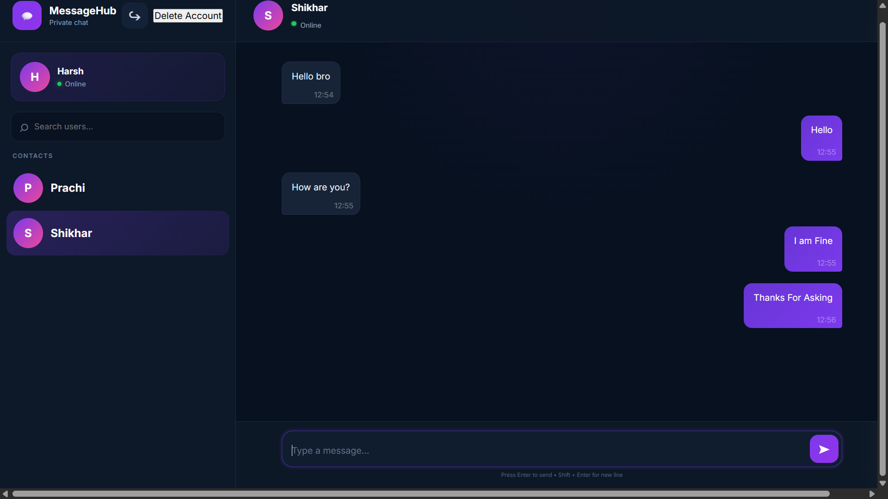

# MessageHub

MessageHub is a private messaging web application built with Java, Spring Boot, MySQL, HTML, CSS, and JavaScript.


<p align="center">
  
</p>

<p align="center">
  🔐 Secure Authentication &nbsp; • &nbsp;
  💬 Private Chat &nbsp; • &nbsp;
  🟢 Online Status
</p>


## Features

- 🔐 Login & Registration
- 💬 Private Messaging
- 🟢 Online/Offline Status
- 🔎 User Search
- 🗑️ Delete Messages
- 👤 Delete Account
- 🔒 JWT Authentication
- 🔑 Bcrypt Password Security
- 📱 Responsive UI

## Tech Stack

- Java
- Spring Boot
- Spring Security
- MySQL
- HTML
- CSS
- JavaScript
- JWT
- Bcrypt

## Project Structure

```text
MessageHub/
│
├── pom.xml
│
├── src/
│   └── main/
│       │
│       ├── java/
│       │   └── com/
│       │       └── messagehub/
│       │           │
│       │           ├── MessageHubApplication.java
│       │           │
│       │           ├── config/
│       │           │   └── SecurityConfig.java
│       │           │
│       │           ├── security/
│       │           │   ├── JwtUtil.java
│       │           │   └── JwtFilter.java
│       │           │
│       │           └── controller/
│       │               ├── AuthController.java
│       │               ├── UserController.java
│       │               └── MessageController.java
│       │
│       └── resources/
│           └── application.properties
│
└── frontend/
    │
    ├── index.html
    ├── style.css
    ├── script.js
    ├── Logo.png
    ├── login.png
    └── chat.png
```

## Database

MySQL database:

```text
messagehub
```

Configure your MySQL username and password in:

```text
application.properties
```

## Run Project

```bash
mvn spring-boot:run
```

Open in browser:

```text
http://localhost:5000/
```

## Screenshots

### Login Page


### Chat Page




## Security
JWT authentication, Spring Security, and Bcrypt password hashing protect user accounts and APIs.

